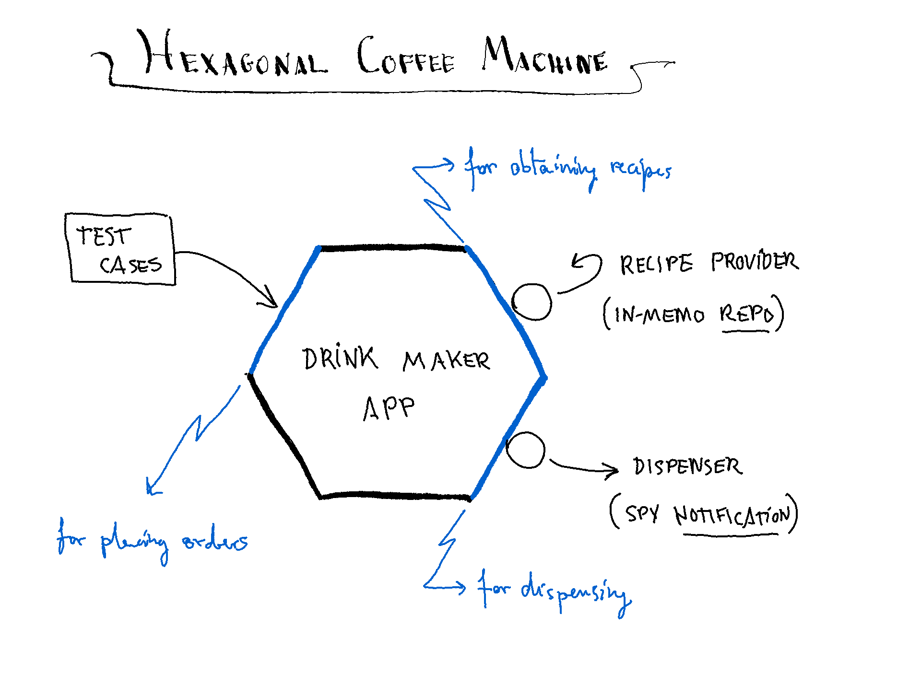

# coffee-machine

## An Hexagonal Application Quick Example.

## Thursday, July 21, 2022

---

### Environment:

- OS: Ubuntu 20.04.4 LTS
- IDE: IntelliJ IDEA 2021.3.3 (Community Edition)
- JAVA: 1.8.0_311
- MAVEN: 3.8.6

### Run:

For running tests so far:

- Download this Github repo
- Open it as a project with the IDE
- Right click on "TestDriver" class file
- Click on "Run TestDriver.main()"
